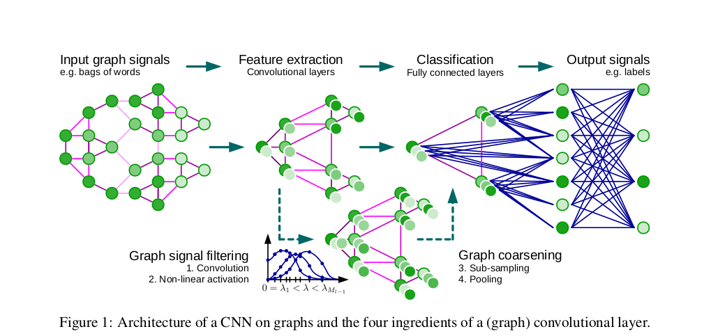

## 2017 - Convolutional Neural Networks on Graphs with Fast Localized Spectral Filtering - [Defferrard et al. 2017](http://arxiv.org/abs/1606.09375)

Very efficient implementation of graph CNN with nice spectral interpretation of the filters using Graph Signal Processing (GSP - see [Shuman et al. 2013](https://arxiv.org/pdf/1211.0053.pdf)). 
The fast implementation is due to the use of Chebyshev polynomial approximations instead of Fourier basis decomposition. The polynomial approximation drives an K-local interpretation that is computationally efficient. 
  
It presents an interesting graph coarsing and pooling approach that I didn't fully grasp. The results were not evaluated on a graph problem that resembles our constraints, as the edges weren't represented by vectors. It is demonstrated on classification tasks (MNIST and 20NEWS)

